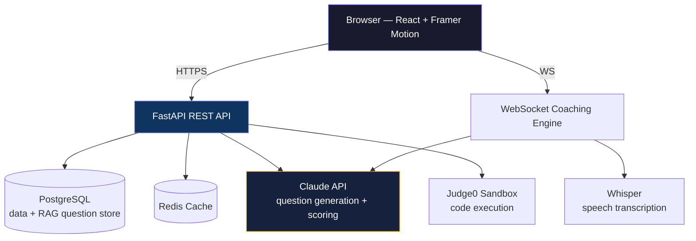

# InterviewCoach AI

> An AI-powered mock interview platform that adapts to a user's skill level, simulates company-specific interview styles, and provides real-time coaching during technical and coding interviews.

### Live Demo
- Frontend: https://interview-coach-ai-three.vercel.app
- Backend API: https://interview-coach-ai-production.up.railway.app
- API Docs (Swagger): https://interview-coach-ai-production.up.railway.app/docs
- Repository: https://github.com/adhi2801/Interview-Coach-AI

---

## Demo

*(Walkthrough — real-time WPM/filler-word telemetry, Socratic vs. Hostile interviewer mutation, and the Judge0 sandboxed code execution pipeline)*

[Watch the demo](https://www.loom.com/share/c3711b231d614d26995cf5b2a0ba922f)

---

## System Architecture



---

## Features

### Adaptive Interview Engine
- ELO-based difficulty adjustment.
- Company-specific interview simulation.
- Knowledge gap detection with prerequisite recommendations.
- Real-time confidence and communication coaching.
- Peer percentile comparison.
- Session replay and diagnostics.

### Coding Interview Engine
- Monaco Editor.
- Python, JavaScript, Java and C++ support.
- Sandboxed code execution using Judge0.
- Adaptive coding problem selection.
- AI-powered Socratic hints.
- Hidden and visible test case evaluation.

---

## Core Engines

| Engine | Description |
|-------|-------|
| Adaptive Difficulty | Dynamically adjusts question difficulty using an ELO rating system. |
| Company DNA | Simulates interviewing styles of top tech companies. |
| Knowledge Graph | Identifies prerequisite topics and recommends study paths. |
| Confidence Coach | Tracks communication metrics in real time. |
| 5-Dimension Scoring | Evaluates technical and behavioral performance. |
| Peer Comparison | Benchmarks performance against other users. |
| Replay System | Reconstructs complete interview sessions. |

---

## Tech Stack

### Frontend
- React
- Tailwind CSS
- Framer Motion
- Monaco Editor
- Recharts
- WebSockets

### Backend
- FastAPI
- PostgreSQL
- Redis
- SQLAlchemy
- Alembic
- Whisper
- Claude API
- Judge0

### Infrastructure
- Railway
- Vercel
- JWT + bcrypt Authentication
- SlowAPI
- Structlog
- Sentry

---

## API Documentation

Every endpoint is documented via FastAPI's auto-generated OpenAPI schema — no separate docs to maintain, always in sync with the actual code:

- **Interactive Swagger UI:** https://interview-coach-ai-production.up.railway.app/docs
- **Raw OpenAPI JSON:** https://interview-coach-ai-production.up.railway.app/openapi.json

---

## RAG Pipeline

- Interview questions are embedded and tagged by difficulty, topic, and company, then stored in PostgreSQL.
- Questions are retrieved using cosine similarity.
- Retrieved prompts are dynamically rewritten into company-specific interviewing styles.
- Uses Retrieval-Augmented Generation instead of static prompting.

---

## Running Locally

```bash
git clone https://github.com/adhi2801/Interview-Coach-AI.git
```

### Backend
```bash
cd backend
python -m venv venv
pip install -r requirements.txt
alembic upgrade head
python seed_topics.py
python seed_coding_problems.py
python seed_db.py
uvicorn main:app --reload
```

### Frontend
```bash
cd frontend
npm install
npm start
```

---

## Testing

```bash
pytest
```

Current coverage (41 tests) includes:
- ELO rating calculations and edge cases.
- Interview category classification.
- Knowledge graph traversal.
- Knowledge gap extraction.

---

## Future Improvements
- Streaming voice transcription.
- PostgreSQL Row-Level Security.
- Expanded automated test coverage.
- WebRTC-based audio support.
- Improved mobile experience.
- LLM observability tooling.
- Editable user profiles.

---

## Author

**Adhiswauran V**
- B.Tech Computer Science (AI)
- Portfolio Project

Also built:
- Real-Time Fraud Detection Engine (Go, Kafka, XGBoost, AUC 0.98)
