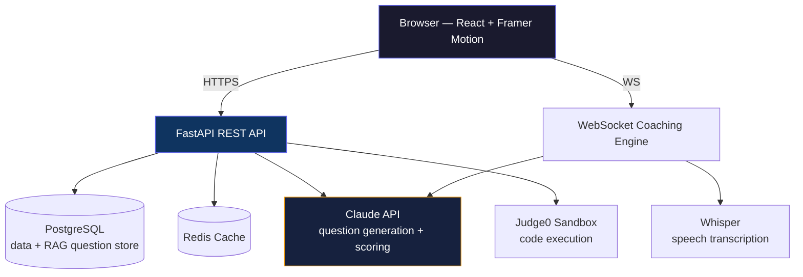

# InterviewCoach AI

[](https://github.com/adhi2801/Interview-Coach-AI/actions/workflows/ci.yml)

> An AI-powered mock interview platform that adapts to a user's skill level, simulates company-specific interview styles, and provides real-time coaching during technical and coding interviews.

### Live Demo
- Frontend: https://interview-coach-ai-three.vercel.app
- Backend API: https://interview-coach-ai-production.up.railway.app
- API Docs (Swagger): https://interview-coach-ai-production.up.railway.app/docs
- Repository: https://github.com/adhi2801/Interview-Coach-AI

---

## Demo

*(Walkthrough — real-time WPM/filler-word telemetry, Socratic vs. Hostile interviewer mutation, and the Judge0 sandboxed code execution pipeline)*

[Watch the demo](https://www.loom.com/share/c3711b231d614d26995cf5b2a0ba922f)

---

## System Architecture


```mermaid
flowchart TB
    User[Browser — React + Framer Motion]
    API[FastAPI REST API]
    WS[WebSocket Coaching Engine]
    DB[(PostgreSQL<br/>data + RAG question store)]
    Cache[(Redis Cache)]
    Claude[Claude API<br/>question generation + scoring]
    Whisper[Whisper<br/>speech transcription]
    Judge0[Judge0 Sandbox<br/>code execution]

    User -->|HTTPS| API
    User -->|WS| WS
    API --> DB
    API --> Cache
    API --> Claude
    WS --> Whisper
    WS --> Claude
    API --> Judge0

    style User fill:#1a1a2e,stroke:#6366f1,color:#fff
    style API fill:#0f3460,stroke:#6366f1,color:#fff
    style Claude fill:#16213e,stroke:#f59e0b,color:#fff
```

---

## Features

### Adaptive Interview Engine
- ELO-based difficulty adjustment.
- Company-specific interview simulation.
- Knowledge gap detection with prerequisite recommendations.
- Real-time confidence and communication coaching.
- Peer percentile comparison.
- Session replay and diagnostics.

### Coding Interview Engine
- Monaco Editor.
- Python, JavaScript, Java and C++ support.
- Sandboxed code execution using Judge0.
- Adaptive coding problem selection.
- AI-powered Socratic hints.
- Hidden and visible test case evaluation.

---

## Core Engines

| Engine | Description |
|-------|-------|
| Adaptive Difficulty | Dynamically adjusts question difficulty using an ELO rating system. |
| Company DNA | Simulates interviewing styles of top tech companies. |
| Knowledge Graph | Identifies prerequisite topics and recommends study paths. |
| Confidence Coach | Tracks communication metrics in real time. |
| 5-Dimension Scoring | Evaluates technical and behavioral performance. |
| Peer Comparison | Benchmarks performance against other users. |
| Replay System | Reconstructs complete interview sessions. |

---

## Tech Stack

### Frontend
- React
- Tailwind CSS
- Framer Motion
- Monaco Editor
- Recharts
- WebSockets

### Backend
- FastAPI
- PostgreSQL
- Redis
- SQLAlchemy
- Alembic
- faster-whisper (Whisper on CTranslate2, int8)
- Claude API (structured outputs)
- Judge0

### Infrastructure
- Railway
- Vercel
- JWT + bcrypt Authentication
- SlowAPI
- Structlog
- Sentry

---

## API Documentation

Every endpoint is documented via FastAPI's auto-generated OpenAPI schema — no separate docs to maintain, always in sync with the actual code:

- **Interactive Swagger UI:** https://interview-coach-ai-production.up.railway.app/docs
- **Raw OpenAPI JSON:** https://interview-coach-ai-production.up.railway.app/openapi.json

---

## Project Structure

```
backend/
  main.py            app assembly: middleware, error handlers, routers
  api/routes/        one router per area: auth, interview, coding, coaching, replay, user, catalogue
  api/services.py    shared engine/client singletons
  engines/           adaptive difficulty, scoring, company DNA, knowledge graph,
                     confidence coach, transcriber, peer comparison, replay
  alembic/           database migrations
  scripts/           seeding and problem-pack tooling; scripts/smoke/ = manual checks against paid APIs
  data/              verified coding problem packs
  tests/             pytest suite (hermetic: no network, no real database)
frontend/            React + Vite SPA
```

---

## Integrity and Security

A candidate's answer decides their rating and feeds everyone else's percentiles, so grading is treated as an attack surface:

- **Prompt-injection hardening.** Answers are fenced in delimiters they cannot close, the grader returns a JSON-schema-enforced result, and any answer that tries to instruct the grader is scored zero by the server.
- **Server-side truth.** Answers are graded against the question the server actually asked, and ELO uses the server's difficulty and rating, never values the client sends.
- **Ownership checks** on every session, job, replay and submission route; the same 404 whether a record is missing or someone else's.
- **WebSocket tickets.** The live-coaching socket takes a one-minute ticket bound to one session, so the login token never appears in a URL or access log.
- Rate limits per IP plus a per-user daily token budget in front of every paid API call.

---

## RAG Pipeline

- Interview questions are embedded and tagged by difficulty, topic, and company, then stored in PostgreSQL.
- Questions are retrieved using cosine similarity.
- Retrieved prompts are dynamically rewritten into company-specific interviewing styles.
- Uses Retrieval-Augmented Generation instead of static prompting.

---

## Running Locally

```bash
git clone https://github.com/adhi2801/Interview-Coach-AI.git
```

### Everything at once (Docker)
```bash
ANTHROPIC_API_KEY=sk-ant-... docker compose up --build   # Postgres, Redis, API, frontend
```
Then seed once (next section's `python -m scripts...` commands, prefixed with `docker compose exec backend`).

### Backend
```bash
cd backend
python -m venv venv
pip install -r requirements-dev.txt
# .env: DATABASE_URL, JWT_SECRET_KEY, ANTHROPIC_API_KEY
#       optional: REDIS_URL, JUDGE0_API_KEY, SENTRY_DSN, CLAUDE_MODEL, WHISPER_MODEL
alembic upgrade head
python -m scripts.seed_topics
python -m scripts.seed_coding_problems
python -m scripts.seed_verified_problems                               # the original 15 verified problems
python -m scripts.seed_verified_problems verified_problems_pack2.json  # 38 more (problem pack 2)
python -m scripts.seed_db
uvicorn main:app --reload
```

Problem pack 2 is built by `python -m scripts.build_problem_pack` from `problem_bank/pack2.py`:
every reference solution is run as a real stdin/stdout program and checked
against an independent brute-force solution on every test case before the
problem is written out. Seeding is idempotent (existing slugs are skipped).

### Frontend
```bash
cd frontend
npm install
npm run dev
```

---

## Testing

```bash
cd backend && ruff check . && pytest        # 66 tests, ~17s, no network or real database needed
cd frontend && npm run lint && npm test      # ESLint + Vitest
```

CI runs all of the above on every push and pull request, and also applies every Alembic migration to a fresh Postgres and fails if `models.py` has drifted from them.

Backend coverage includes auth and ownership on every user-data route, the atomic scoring/ELO pipeline, grading-integrity and prompt-injection defences, the live-coaching socket and its tickets, filler/pace detection in the confidence coach, ELO math, category classification, and knowledge-graph traversal and gap extraction.

---

## Future Improvements
- Streaming voice transcription.
- PostgreSQL Row-Level Security.
- End-to-end browser tests.
- WebRTC-based audio support.
- Improved mobile experience.
- LLM observability tooling.

---

## Author

**Adhiswauran V**
- B.Tech Computer Science (AI)
- Portfolio Project

Also built:
- Real-Time Fraud Detection Engine (Go, Kafka, XGBoost, AUC 0.98)
